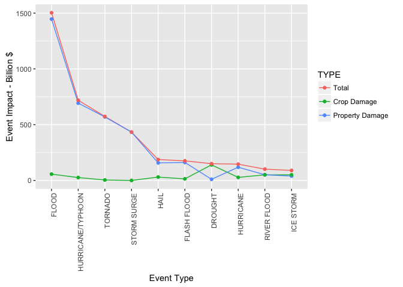

# Severe Weather Events Investigation
Johan Jordaan  
16 March 2016  

## Synopsis
Synopsis: Immediately after the title, there should be a synopsis which describes and summarizes your analysis in at most 10 complete sentences.

Across the United States, which types of events (as indicated in the 𝙴𝚅𝚃𝚈𝙿𝙴 variable) are most harmful with respect to population health?
Across the United States, which types of events have the greatest economic consequences?

## Data Processing

```r
library(lubridate)
library(dplyr)
library(ggplot2)
library(tidyr)
```


```r
data <- read.csv("repdata-data-StormData.csv.bz2")
```

### Data Quality

####Event Type Data Quality

```r
sum(is.na(data$EVTYPE))
```

```
## [1] 0
```

This series contains no NA values in passes the data quality criteria.

####Injury/Fatality Data Quality

```r
sum(is.na(data$FATALITIES))
```

```
## [1] 0
```

```r
sum(is.na(data$INJURIES))
```

```
## [1] 0
```

These series contains no NA values in passes the data quality criteria.

####Property Damage Data Quality

```r
sum(is.na(data$PROPDMG))
```

```
## [1] 0
```

```r
table(data$PROPDMGEXP)
```

```
## 
##             +      -      0      1      2      3      4      5      6 
## 465934      5      1    216     25     13      4      4     28      4 
##      7      8      ?      B      H      K      M      h      m 
##      5      1      8     40      6 424665  11330      1      7
```

The PROPDMG series contains no NA values in passes the data quality criteria.
The PROPDMGEXP series should only contain K(Thousands), M(Millions) and B(Billions) values. 


####Crop Damage Data Quality

```r
sum(is.na(data$CROPDMG))
```

```
## [1] 0
```

```r
table(data$CROPDMGEXP)
```

```
## 
##             0      2      ?      B      K      M      k      m 
## 618413     19      1      7      9 281832   1994     21      1
```

The CROPDMG series contains no NA values in passes the data quality criteria.
The CROPDMGEXP series should only contain K(Thousands), M(Millions) and B(Billions) values. 

### Data Cleanup and Enhancement

I will be replacing all values in PROPDMGEXP and CROPDMGEXP that fall outside of this range (K,M,B) with the most populous value, namely K. I am assuming the American definition of Billion which is M*1000. I further correct for possible capitlisation descrepancies.


```r
m <- function(exp) {
  ifelse(exp %in% c("B","b"),1000000*1000,ifelse(exp %in% c("M","m"),1000000,1000))  
}

data <- data %>% mutate(ABSPROPDMG = PROPDMG * m(PROPDMGEXP), ABSCROPDMG = CROPDMG * m(CROPDMGEXP))
```

### Data Aggregation

Please note that in the aggregate I normalise the damage amount to billions by deviding the total amouns by one billion. I apply this normalisation here to reduce roudning effects. I further transform the data to tidy data to make plotting an d further analysis easier.


```r
data <- data %>%
        group_by(EVTYPE) %>%
        summarize( TOT_FATALITIES=sum(FATALITIES)
                  ,TOT_INJURIES=sum(INJURIES)
                  ,TOTAL_HEALTH=TOT_FATALITIES+TOT_INJURIES
                  ,TOT_PROPDMG=sum(ABSPROPDMG)/100000000
                  ,TOT_CROPDMG=sum(ABSCROPDMG)/100000000
                  ,TOTAL_DAMAGE=TOT_PROPDMG+TOT_CROPDMG
                  )

health <- data %>% 
          filter(TOTAL_HEALTH>0) %>% 
          select(EVTYPE,TOT_FATALITIES,TOT_INJURIES,TOTAL_HEALTH) %>%
          arrange(desc(TOTAL_HEALTH)) %>%
          top_n(10,TOTAL_HEALTH) %>%
          gather(TYPE,VALUE,TOT_FATALITIES:TOTAL_HEALTH) %>% 
          mutate(EVTYPE=factor(EVTYPE),TYPE=factor(TYPE,labels=c("Total","Fatalities","Injuries")))

#health %>% filter(EVTYPE == "TORNADO")
health
```

```
## Source: local data frame [30 x 3]
## 
##               EVTYPE       TYPE VALUE
##               (fctr)     (fctr) (dbl)
## 1            TORNADO Fatalities  5633
## 2     EXCESSIVE HEAT Fatalities  1903
## 3          TSTM WIND Fatalities   504
## 4              FLOOD Fatalities   470
## 5          LIGHTNING Fatalities   816
## 6               HEAT Fatalities   937
## 7        FLASH FLOOD Fatalities   978
## 8          ICE STORM Fatalities    89
## 9  THUNDERSTORM WIND Fatalities   133
## 10      WINTER STORM Fatalities   206
## ..               ...        ...   ...
```

```r
damage <- data %>% 
          filter(TOTAL_DAMAGE>0) %>% 
          select(EVTYPE,TOT_PROPDMG,TOT_CROPDMG,TOTAL_DAMAGE) %>%
          arrange(desc(TOTAL_DAMAGE)) %>%
          top_n(10,TOTAL_DAMAGE) %>%
          gather(TYPE,VALUE,TOT_PROPDMG,TOT_PROPDMG:TOTAL_DAMAGE) %>% 
          mutate(EVTYPE=factor(EVTYPE),TYPE=factor(TYPE,labels=c("Total","Crop Damage","Property Damage")))

damage
```

```
## Source: local data frame [30 x 3]
## 
##               EVTYPE            TYPE      VALUE
##               (fctr)          (fctr)      (dbl)
## 1              FLOOD Property Damage 1446.57717
## 2  HURRICANE/TYPHOON Property Damage  693.05840
## 3            TORNADO Property Damage  569.37459
## 4        STORM SURGE Property Damage  433.23536
## 5               HAIL Property Damage  157.32594
## 6        FLASH FLOOD Property Damage  161.41369
## 7            DROUGHT Property Damage   10.46106
## 8          HURRICANE Property Damage  118.68319
## 9        RIVER FLOOD Property Damage   51.18946
## 10         ICE STORM Property Damage   39.44978
## ..               ...             ...        ...
```

## Exploratory Graphs
### Health Impact by Event Type

```r
ggplot(health,aes(reorder(EVTYPE,-VALUE),VALUE,color=TYPE,group=TYPE)) + 
  geom_line() +
  geom_point() +
  theme(axis.text.x = element_text(angle = 90, hjust = 1)) +
  xlab("Event Type") +
  ylab("Event Impact - Individuals")
```


### Damage by Event Type

```r
ggplot(damage,aes(reorder(EVTYPE,-VALUE),VALUE,color=TYPE,group=TYPE)) + 
  geom_line() +
  geom_point() +
  theme(axis.text.x = element_text(angle = 90, hjust = 1)) +
  xlab("Event Type") +
  ylab("Event Impact - Billion $")
```



## Results
At least one but not more than 3 figures


