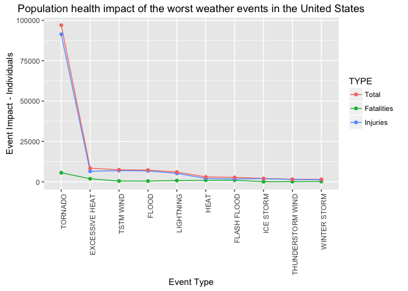
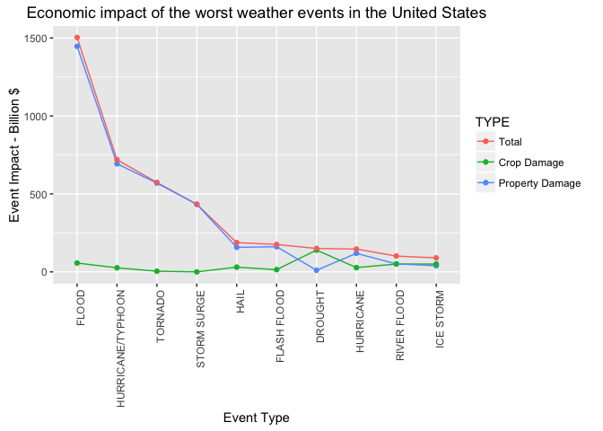

# Severe Weather Events Investigation
Johan Jordaan  
16 March 2016  

## Synopsis
This investigation aimed to answer the following two questions:

1. Across the United States, which types of events are most harmful with respect to population health?
2. Across the United States, which types of events have the greatest economic consequences?

The data was sourced from the U.S. National Oceanic and Atmospheric Administration's (NOAA) storm database and can be found [here](https://d396qusza40orc.cloudfront.net/repdata%2Fdata%2FStormData.csv.bz2).

## Assumptions 
I made some assumptions in the investigation in order to answer the above two questions. The following list enumerates these assumptions:

* I assumed the American definition for a billion, which is a thousand million.
* I assumed that 'harmful with respect to population health' is measured by the number of injuries and fatalities. 
* I assumed that 'have the greatest economic consequences' is measured by the damage to property and crops and does not include harmful effects on population health.
* I have excluded any kind of normalisation to account for inflation.
* The analysis was done on the aggregate data in the database that stretched from 1950 to 2011. 

## Data Processing

```r
library(dplyr)
library(ggplot2)
library(tidyr)
```


```r
data <- read.csv("repdata-data-StormData.csv.bz2")
```

### Data Quality
The data quality was quite high in my opinion with only the PROPDMGEXP and CROPDMGEXP variables needing some kind of cleanup.

####Event Type Data Quality
The EVTYPE variable contained no NA values and required no cleanup.


```r
sum(is.na(data$EVTYPE))
```

```
## [1] 0
```


####Injury/Fatality Data Quality
The FATALITIES and INJURIES variables contained no NA or negative values and required no cleanup.


```r
sum(is.na(data$FATALITIES))
```

```
## [1] 0
```

```r
sum(data$FATALITIES<0)
```

```
## [1] 0
```

```r
sum(is.na(data$INJURIES))
```

```
## [1] 0
```

```r
sum(data$INJURIES<0)
```

```
## [1] 0
```


####Property Damage Data Quality
The PROPDMG variable contained no NA or negative values and required no cleanup.


```r
sum(is.na(data$PROPDMG))
```

```
## [1] 0
```

```r
sum(data$PROPDMG<0)
```

```
## [1] 0
```

The PROPDMGEXP variable should have only contained K(Thousands), M(Millions) and B(Billions) values. Since it contained other values this series needed to be cleaned.


```r
table(data$PROPDMGEXP)
```

```
## 
##             +      -      0      1      2      3      4      5      6 
## 465934      5      1    216     25     13      4      4     28      4 
##      7      8      ?      B      H      K      M      h      m 
##      5      1      8     40      6 424665  11330      1      7
```

####Crop Damage Data Quality
The CROPDMG variable contained no NA or negative values and required no cleanup.


```r
sum(is.na(data$CROPDMG))
```

```
## [1] 0
```

```r
sum(data$CROPDMG<0)
```

```
## [1] 0
```

The CROPDMGEXP variable should have only contained K(Thousands), M(Millions) and B(Billions) values. Since it contained other values this series needed to be cleaned.


```r
table(data$CROPDMGEXP)
```

```
## 
##             0      2      ?      B      K      M      k      m 
## 618413     19      1      7      9 281832   1994     21      1
```

### Data Cleanup and Enhancement

I replaced all the values in the PROPDMGEXP and CROPDMGEXP variables that fell outside of the valid range (K,M,B) with the most populous value, namely K. 

I further compensated for possible capitalisation discrepancies.


```r
m <- function(exp) {
  ifelse(exp %in% c("B","b"),1000000*1000,ifelse(exp %in% c("M","m"),1000000,1000))  
}

data <- data %>% mutate(ABSPROPDMG = PROPDMG * m(PROPDMGEXP), ABSCROPDMG = CROPDMG * m(CROPDMGEXP))
```

### Data Aggregation

In the aggregate I normalised the damage amount to billions by dividing the total amounts by one billion. I applied this normalisation here, and not earlier, to reduce rounding effects. I further transformed the data to 'tidy data' to make plotting and subsequent analysis easier.


```r
top <- 10

data <- data %>%
        group_by(EVTYPE) %>%
        summarize( TOT_FATALITIES=sum(FATALITIES)
                  ,TOT_INJURIES=sum(INJURIES)
                  ,TOTAL_HEALTH=TOT_FATALITIES+TOT_INJURIES
                  ,TOT_PROPDMG=sum(ABSPROPDMG)/100000000
                  ,TOT_CROPDMG=sum(ABSCROPDMG)/100000000
                  ,TOTAL_DAMAGE=TOT_PROPDMG+TOT_CROPDMG
                  )

health <- data %>% 
          filter(TOTAL_HEALTH>0) %>% 
          select(EVTYPE,TOT_FATALITIES,TOT_INJURIES,TOTAL_HEALTH) %>%
          arrange(desc(TOTAL_HEALTH)) %>%
          top_n(top,TOTAL_HEALTH) %>%
          gather(TYPE,VALUE,TOT_FATALITIES:TOTAL_HEALTH) %>% 
          mutate(EVTYPE=factor(EVTYPE),TYPE=factor(TYPE,labels=c("Total","Fatalities","Injuries")))

damage <- data %>% 
          filter(TOTAL_DAMAGE>0) %>% 
          select(EVTYPE,TOT_PROPDMG,TOT_CROPDMG,TOTAL_DAMAGE) %>%
          arrange(desc(TOTAL_DAMAGE)) %>%
          top_n(top,TOTAL_DAMAGE) %>%
          gather(TYPE,VALUE,TOT_PROPDMG,TOT_PROPDMG:TOTAL_DAMAGE) %>% 
          mutate(EVTYPE=factor(EVTYPE),TYPE=factor(TYPE,labels=c("Total","Crop Damage","Property Damage")))
```

Note that I only selected the top ``10`` TOTAL_DAMAGE and TOTAL_HEALTH elements in the list. 


```r
health
```

```
## Source: local data frame [30 x 3]
## 
##               EVTYPE       TYPE VALUE
##               (fctr)     (fctr) (dbl)
## 1            TORNADO Fatalities  5633
## 2     EXCESSIVE HEAT Fatalities  1903
## 3          TSTM WIND Fatalities   504
## 4              FLOOD Fatalities   470
## 5          LIGHTNING Fatalities   816
## 6               HEAT Fatalities   937
## 7        FLASH FLOOD Fatalities   978
## 8          ICE STORM Fatalities    89
## 9  THUNDERSTORM WIND Fatalities   133
## 10      WINTER STORM Fatalities   206
## ..               ...        ...   ...
```

```r
damage
```

```
## Source: local data frame [30 x 3]
## 
##               EVTYPE            TYPE      VALUE
##               (fctr)          (fctr)      (dbl)
## 1              FLOOD Property Damage 1446.57717
## 2  HURRICANE/TYPHOON Property Damage  693.05840
## 3            TORNADO Property Damage  569.37459
## 4        STORM SURGE Property Damage  433.23536
## 5               HAIL Property Damage  157.32594
## 6        FLASH FLOOD Property Damage  161.41369
## 7            DROUGHT Property Damage   10.46106
## 8          HURRICANE Property Damage  118.68319
## 9        RIVER FLOOD Property Damage   51.18946
## 10         ICE STORM Property Damage   39.44978
## ..               ...             ...        ...
```

## Exploratory Graphs
### Health Impact by Event Type

```r
ggplot(health,aes(reorder(EVTYPE,-VALUE),VALUE,color=TYPE,group=TYPE)) + 
  geom_line() +
  geom_point() +
  theme(axis.text.x = element_text(angle = 90, hjust = 1)) +
  xlab("Event Type") +
  ylab("Event Impact - Individuals") +
  ggtitle("Population health impact of the worst weather events in the United States")
```



### Damage by Event Type

```r
ggplot(damage,aes(reorder(EVTYPE,-VALUE),VALUE,color=TYPE,group=TYPE)) + 
  geom_line() +
  geom_point() +
  theme(axis.text.x = element_text(angle = 90, hjust = 1)) +
  xlab("Event Type") +
  ylab("Event Impact - Billion $") +
  ggtitle("Economic impact of the worst weather events in the United States")
```



## Results

In summary, the goal of the investigation was to answer these two questions:

1. Across the United States, which types of events are most harmful with respect to population health?
2. Across the United States, which types of events have the greatest economic consequences?

The answers to these two questions given my assumptions and analysis are:

1. Accross the United States, *tornados* are the most harmfull with respect to population health.
2. Accross the United States, *floods* have the greatest economic consequences.


## Further Work

Unfortunately this investigation was constrained by the requirements and time limits. In doing this investigation the following open questions ocurred to me and might be interesting enough to warrant future analisis:

1. What is the progression over time for the events with the highest impact? We know that tornados have the highest impact on population health, but has this always been the case?
2. Would the results of this study be different if the values are inflation/market adjusted?
3. Are there any events that in aggregate have less impact but have a higher average and occur more frequently? This might indicate 'low hanging fruit' for event preparation.
4. How can we quantify injuries and fatalities so that they can be added to the economic loss of property and crops, in order to get a better economic impact?
5. Is the impact of events localised in terms of economic and population health impact?

These are but a few of the questions that popped into my mind while doing this investigation. I am looking forward to answering some of the above questions, and in answering them generating a whole bunch of new questions.


